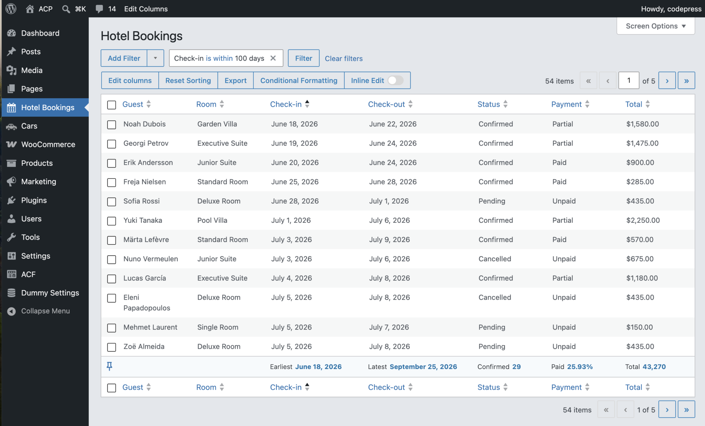

# Hotel Bookings — Admin Columns Pro Custom List Table example

A small, self‑contained WordPress plugin that turns three plain database tables
into a fully‑featured admin screen using **Admin Columns Pro**'s *Custom List
Tables* feature (powered by the **Data Sources** addon).

It exists to be read. If you have your own custom tables — bookings, orders,
events, IoT readings, anything that lives outside `wp_posts` — this repo shows
you the smallest realistic amount of code needed to give them a sortable,
filterable, inline‑editable admin table, with related lookups resolved to
human‑readable labels.



| | |
|---|---|
| **Requires** | Admin Columns Pro **7.1+** with the **Data Sources** addon active, PHP 7.4+ |
| **Demo dataset** | ~210 bookings, 80 guests, 10 rooms |
| **What you write** | One ~140‑line PHP class. No PHP view templates, no React, no `WP_List_Table` subclass. |

> Official guide: [How to set up Custom List Tables](https://docs.admincolumns.com/article/120-how-to-setup-custom-list-tables)
> More recipes: [Custom List Tables Cookbook](https://github.com/codepress/ac-custom-list-tables-cookbook)

---

## Get Started

Seeing the result makes the code easier to read.

1. Make sure **Admin Columns Pro 7.1+** is active with the **Data Sources**
   addon enabled. (If it isn't, the plugin shows an admin notice explaining
   why the table won't appear — see [`Requirements.php`](classes/Requirements.php).)
2. [Download](https://github.com/codepress/ac-examples-bookings/archive/refs/heads/main.zip) the Hotel
   Bookings example plugin and drop this folder into `wp-content/plugins/`. No
   build step and no dependencies — the classes are loaded with plain `require`s
   in the bootstrap, so there's nothing to install.
3. Activate **"ACP Sample Data – Hotel Bookings"** in WordPress. Activation
   automatically creates `wp_hbk_guests`, `wp_hbk_rooms` and `wp_hbk_bookings`
   and loads the demo rows — no manual import step.
4. Open the new **Hotel Bookings** menu item in the admin sidebar and explore the
   available views.

Need to reinstall or start over? **Tools → Hotel Bookings Sample Data** has
**"Create & populate sample tables"** and **"Drop tables (reset)"** buttons.
Deactivating the plugin drops the tables (they're recreated on reactivation), and
deleting the plugin removes them too (see [`uninstall.php`](uninstall.php)).

---

## The idea in one minute

WordPress gives you list tables for posts, pages, users and comments out of the
box. Anything else — your own custom tables — normally means subclassing
`WP_List_Table`, writing column callbacks, wiring up sorting, pagination,
filters and bulk actions by hand. It's a lot of boilerplate.

Admin Columns Pro's Data Sources addon flips this around. You **describe** a
table to the addon — its name, which columns to show, how those columns should
behave, and how it relates to other tables — and the addon builds the entire
admin screen for you, including the bits Admin Columns is already good at:
sorting, smart filters, inline editing, conditional formatting, export and
footer metrics.

So the work splits cleanly into two halves:

1. **Code (this repo):** register the table and *type* its columns. Done once,
   in PHP, on a hook.
2. **UI (no code):** open the generated screen in Admin Columns and arrange
   columns, set display formats, add filters and formatting rules. Stored in
   the `wp_admin_columns` table, not here.

This example covers both — the code in full, and the UI steps as a checklist so
you can reproduce the polished result.

---

## The data model

Three ordinary tables — nothing Admin Columns‑specific about them. This is
deliberate: the point is that *your existing schema* needs no changes.

```
wp_hbk_bookings                        wp_hbk_guests
┌───────────────────────────┐            ┌──────────────────────────┐
│ id            (PK)        │      ┌────▶│ id              (PK)     │
│ reference                 │      │     │ first_name               │
│ guest_id  ────────────────┼──────┘     │ last_name                │
│ room_id   ────────────────┼──────┐     │ full_name  (generated)   │ ◀── label
│ check_in   (unix ts)      │      │     │ email                    │
│ check_out  (unix ts)      │      │     │ phone / country          │
│ nights / guests_count     │      │     └──────────────────────────┘
│ total_amount / amount_paid│      │
│ status         (0–3)      │      │     wp_hbk_rooms
│ payment_status (0–2)      │      │     ┌──────────────────────────┐
│ source                    │      └────▶│ id              (PK)     │
│ notes                     │            │ room_code                │
│ created_at / updated_at   │            │ room_type                │ ◀── label
└───────────────────────────┘            │ capacity / rate / active │
                                         └──────────────────────────┘
```

Two things in the schema are worth calling out because the registration code
relies on them:

- **`check_in` / `check_out` are stored as Unix timestamps** (`int`), not
  `DATETIME`. The code types them with the PHP date format `'U'` so the addon
  knows how to read them.
- **`status` and `payment_status` are integer codes** (`0,1,2,3`). The code
  maps each code to a label so the cell shows "Confirmed", not `1`.
- **`guests.full_name` is a generated column.** It's used as the guest table's
  display label, so a related Guest column reads "Mia van Dijk" instead of `7`.

Full schema and rows: [`data/sample-data.sql`](data/sample-data.sql).

---

## The code that matters

Everything interesting is in
[`classes/CustomListTableInit.php`](classes/CustomListTableInit.php). Read that
file alongside this section — it's heavily commented and short.

### Where registration happens

The addon fires a hook when it's ready to collect data sources. You register on
it. That's the entire integration surface.

```php
class CustomListTableInit
{
    public function __construct()
    {
        add_action('acp/data-sources/register', [$this, 'register']);
    }

    public function register(DataSourceRegistry $registry): void
    {
        // ...build DataSource objects and $registry->register(...) them
    }
}
```

If Admin Columns Pro or the Data Sources addon isn't active, the hook never
fires and nothing happens — no fatal errors. That's why
[`Requirements.php`](classes/Requirements.php) detects the capability by class
existence (`class_exists('ACA\\DataSources\\DataSourceRegistry')`) rather than
comparing version strings, which keeps it working on pre‑release builds like
`7.1beta`.

### Anatomy of a Data Source

A `DataSource` is three (sometimes four) things:

```php
$bookings = new DataSource(
    new DataSourceId('hbk_bookings'),        // 1. a stable, unique id
    Facade\Table::from('wp_hbk_bookings'),   // 2. the table (+ optional label column)
    $bookings_columns,                       // 3. column configuration
    new Facade\Relations([ /* ... */ ])      // 4. (optional) relations to other sources
);
```

1. **`DataSourceId`** — a slug that identifies this source. It also determines
   the admin page URL: the addon registers the screen as
   `acp-data-sources-{id}`, so `hbk_bookings` → `admin.php?page=acp-data-sources-hbk_bookings`.
   (See how [`AdminPage.php`](classes/SampleData/AdminPage.php) builds the
   "View the table →" link from exactly this rule.)
2. **`Facade\Table::from($table, $label_column)`** — names the table. The
   optional second argument is the *identifier/label column*: the column shown
   when this source is referenced from elsewhere. The bookings table omits it
   (defaults to the primary key); the lookups set it deliberately (below).
3. **Column config** — which columns appear and how each behaves (next section).
4. **Relations** — how this table joins to others (the section after that).

You register each source with `$registry->register(new Entry($source))`. Only
the source you want a menu for gets one:

```php
$registry->register(
    Entry::create($bookings)
        ->set_menu('Hotel Bookings', 'Hotel Bookings', 'dashicons-calendar-alt', 25)
);
```

`set_menu($page_title, $menu_title, $icon, $position)` is what makes **Hotel
Bookings** appear as a top‑level admin menu item. The two lookup tables are
registered *without* a menu — they exist only to feed the relations, so they
shouldn't clutter the sidebar.

### Typing columns

By default the addon shows columns as plain text. *Typing* a column tells the
addon how to read and render the underlying value, which unlocks the right
default display, sorting behaviour and inline‑edit control. This is the part
worth getting right — good types mean almost no UI tweaking afterwards.

```php
$bookings_columns = Config\Columns::create()
    ->with_columns([
        ColumnType\TextType::for('reference')->with_label('Ref.'),

        // Stored as a Unix timestamp -> pass the PHP date format 'U'.
        ColumnType\DateTimeType::for('check_in', 'U')->with_label('Check-in'),
        ColumnType\DateTimeType::for('check_out', 'U')->with_label('Check-out'),

        ColumnType\NumberType::for('total_amount')->with_label('Total'),

        // Integer codes -> human labels.
        ColumnType\SelectColumnType::for('status', [
            0 => 'Pending',
            1 => 'Confirmed',
            2 => 'Cancelled',
            3 => 'Completed',
        ])->with_label('Status'),
    ])
    ->with_label_resolver(new HumanReadableResolver());
```

Types used in this example:

| Type | Use it for | Note |
|---|---|---|
| `TextType` | strings (`reference`, `source`) | |
| `NumberType` | numeric columns (`nights`, `total_amount`, `rate`) | |
| `DateTimeType::for($col, $format)` | dates/times | pass the PHP date format the column is stored in — here `'U'` for Unix timestamps |
| `SelectColumnType::for($col, $map)` | integer/enum codes | the `$map` turns `1` into `Confirmed` |
| `EmailType` | email addresses | gets a `mailto:` treatment |
| `BooleanType` | yes/no flags (`active`) | |

`with_label('…')` sets the column header. **`with_label_resolver(new
HumanReadableResolver())`** is the catch‑all for every *untyped* column: it
turns raw column names like `created_at` into "Created At" automatically, so you
only have to name the columns you care about.

You don't need to type every column — anything you skip still appears, just as
generic text with a humanised header.

### Relations: turning foreign keys into names

A booking stores `guest_id = 7` and `room_id = 3`. On their own those are
meaningless integers. Relations tell the addon how to follow them.

First, register the two lookup tables as their own data sources — each with a
**label column** so the relation knows what to display:

```php
$guests = new DataSource(
    new DataSourceId('hbk_guests'),
    Facade\Table::from('wp_hbk_guests', 'full_name'),   // <- label column
    Config\Columns::create()
        ->with_columns([ ColumnType\EmailType::for('email')->with_label('Email') ])
        ->with_label_resolver(new HumanReadableResolver())
);
$registry->register(new Entry($guests));                // no menu
```

Then declare the relations on the bookings source:

```php
new Facade\Relations([
    // bookings.guest_id -> guests.id, displayed as a "Guest" column
    Facade\Relation\Column::has_one($guests, 'id', 'Guest', 'guest_id'),

    // bookings.room_id  -> rooms.id,   displayed as a "Room" column
    Facade\Relation\Column::has_one($rooms, 'id', 'Room', 'room_id'),
])
```

`has_one($target_source, $target_key, $label, $local_key)` reads as: *each
booking has one guest; match `bookings.guest_id` to `guests.id`; call the column
"Guest".* Because the guests source declared `full_name` as its label column,
the Guest column renders "Mia van Dijk" — and because guests is itself a typed
data source, you can switch that column to show the email or any other guest
field from the Admin Columns UI, no code change needed.

This is the payoff of registering the lookups as real data sources rather than
hard‑coding a join: every related table is itself fully typed and reusable.

---

## What you do in the UI (no code)

The code gives you a working, sensible table. The finishing touches live in
Admin Columns and are stored per‑view in `wp_admin_columns`. Open the **Hotel
Bookings** screen, click the Admin Columns settings, and:

- **Columns** — choose which to show and their order.
- **Guest column** → set its "Column" to **Guest** (`full_name`); **Room** →
  **Room type**.
- **Total / Paid** → display as **Currency**, EUR (`€1,234.00`).
- **Check‑in / Check‑out** → date display format `j M Y` (e.g. `18 Jun 2026`).
- **Status** → add **Conditional Formatting** colour pills (Pending amber,
  Confirmed green, Cancelled red, Completed blue).
- **Footer Metrics** → Total = *Sum* of Total, Avg booking = *Average* of Total,
  Bookings = *Count* of Ref.
- **Smart Filters** → enable on Status, Source, and a Check‑in date range.

The class docblock in
[`CustomListTableInit.php`](classes/CustomListTableInit.php) lists these same
steps next to the code, so you can see which half does what.

**You don't have to do any of this by hand.** This plugin ships two of these
arrangements as templates ([`data/*.json`](data/)) and **imports them as saved
views on first run** (see
[`ImportTemplates.php`](classes/Service/ImportTemplates.php)), so the **Hotel
Bookings** screen opens with the finished layout — columns, formats, filters and
formatting rules — already applied. Tweak from there, or use the Admin Columns
template picker to reload **"Bookings Example"** at any time. (The auto‑import
runs once; deleting or editing the views won't make it run again.)

---

## How the plugin is wired together

The bootstrap is [`ac-examples-bookings.php`](ac-examples-bookings.php), and it
does only a few things:

```php
(new Requirements())->register();   // admin notice if ACP/Data Sources missing

new CustomListTableInit();          // <-- the part you came here for

(new AdminPage(                     // Tools page to install/reset the demo data
    new Installer(__DIR__ . '/data/sample-data.sql')
))->register();

(new LocalTemplates(                // ship the data/*.json column templates
    new SplFileInfo(__DIR__ . '/data')
))->register();

(new ImportTemplates(               // import those templates as saved views once
    new SplFileInfo(__DIR__ . '/data')
))->register();
```

| File | Responsibility |
|---|---|
| [`ac-examples-bookings.php`](ac-examples-bookings.php) | Plugin header, `require`s the classes, bootstrap |
| [`classes/CustomListTableInit.php`](classes/CustomListTableInit.php) | **The example.** Registers the data sources, types, relations and menu |
| [`classes/Requirements.php`](classes/Requirements.php) | Detects whether ACP + Data Sources is active; shows a notice if not |
| [`classes/PluginActionLinks.php`](classes/PluginActionLinks.php) | Adds an "Edit Columns" link to the plugin row, opening the column editor |
| [`classes/SampleData/AdminPage.php`](classes/SampleData/AdminPage.php) | Tools → "Hotel Bookings Sample Data" page (install / reset) |
| [`classes/SampleData/Installer.php`](classes/SampleData/Installer.php) | Creates/drops the demo tables, runs the bundled SQL dump |
| [`classes/Service/LocalTemplates.php`](classes/Service/LocalTemplates.php) | Registers the bundled `data/*.json` column templates as pre‑defined templates |
| [`classes/Service/ImportTemplates.php`](classes/Service/ImportTemplates.php) | Imports those templates as saved views once, on first run |
| [`data/sample-data.sql`](data/sample-data.sql) | Schema + demo rows |
| [`data/*.json`](data/) | Column templates — registered as loadable templates and auto‑imported as saved views |
| [`uninstall.php`](uninstall.php) | Drops the demo tables when the plugin is deleted |

The sample‑data machinery (`AdminPage`, `Installer`) is *scaffolding for this
demo*, not part of the Custom List Tables pattern. You won't need it in your own
plugin — your tables already exist. It's a good reference, though, for a clean
admin‑post form with nonce checks, the Post/Redirect/Get pattern, and a
defensive SQL‑dump runner that won't clobber populated tables.

---

## Adapting this to your own tables

A practical checklist, mapping each step to where it lives in the example:

1. **Pick the hook.** `add_action('acp/data-sources/register', …)` and accept
   the `DataSourceRegistry`.
2. **Register your main table** as a `DataSource` with a unique `DataSourceId`
   and `Facade\Table::from('your_table')`.
3. **Type the columns** that need it (dates with their stored format, codes via
   `SelectColumnType`, emails, numbers…) and add a `HumanReadableResolver` for
   the rest.
4. **Give it a menu** with `Entry::create($source)->set_menu(...)`.
5. **For each foreign key**, register the referenced table as its own
   (menu‑less) `DataSource` with a label column, then add a
   `Facade\Relation\Column::has_one(...)` on the main source.
6. **Open the screen** and finish the presentation in the Admin Columns UI.

Then guard your plugin the way [`Requirements.php`](classes/Requirements.php)
does, so it degrades gracefully when the addon isn't present.

For variations on this pattern — different relation types, more column types,
edge cases — see the [Custom List Tables
Cookbook](https://github.com/codepress/ac-custom-list-tables-cookbook) and the
[official documentation](https://docs.admincolumns.com/article/120-how-to-setup-custom-list-tables).